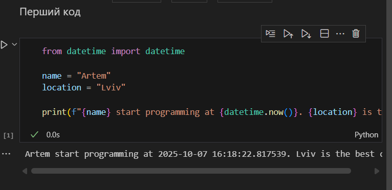

# Звіт до роботи
## Тема: _Вступні заняття: налаштування середовища, прочаток роботи з Python та Markdown;

### Мета роботи: _Налаштувати середовище роботи VS Code, створити репозиторій Github та налаштувати інтеграцію з ним, написати першу програму на Python та створити звіт з використанням форматування Markdown;_

---
### Виконання роботи
* Результати виконання завдання *1...N*;
    1. Встанивив VS
    1. Встановив плагіни python, jupiter, copilot
  
### перший код

* скопіював запропонований код, та запустив
    ```python
    from datetime import datetime

    name = "Artem"
    location = "Lviv"

    print(f"{name} start programming at {datetime.now()}. {location} is the best city!")
    ```
    
    - Отримав такий результат:
    ```text
    << Artem start programming at 2025-10-07 16:15:14.839651. Lviv is the best city! >>
    ```
* створив ффайл 1_1.inpynb, у ньому створив поле маркдауну і написав мій перший код, після цього створив поле для пайтону і скопіював туди запропонований код:
  ,
* Створив файл copilot.py і попросив copilot: 'Напиши першу програму яку б написав ШІ, програма має містити зміні та математичні функції':
    ```python
    a = 5
    b = 3

    sum_result = a + b
    diff_result = a - b
    prod_result = a * b
    div_result = a / b

    print("Сума:", sum_result)
    print("Різниця:", diff_result)
    print("Добуток:", prod_result)
    print("Ділення:", div_result)
    ```
* Отримав такий результат:
    ```text
    << Сума: 8
    Різниця: 2
    Добуток: 15
    Ділення: 1.6666666666666667>>
    ```