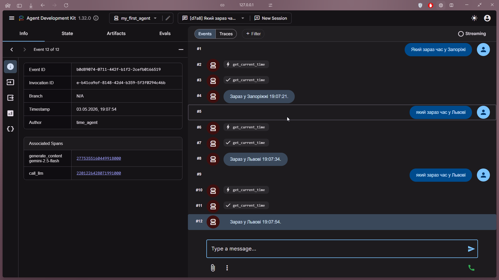
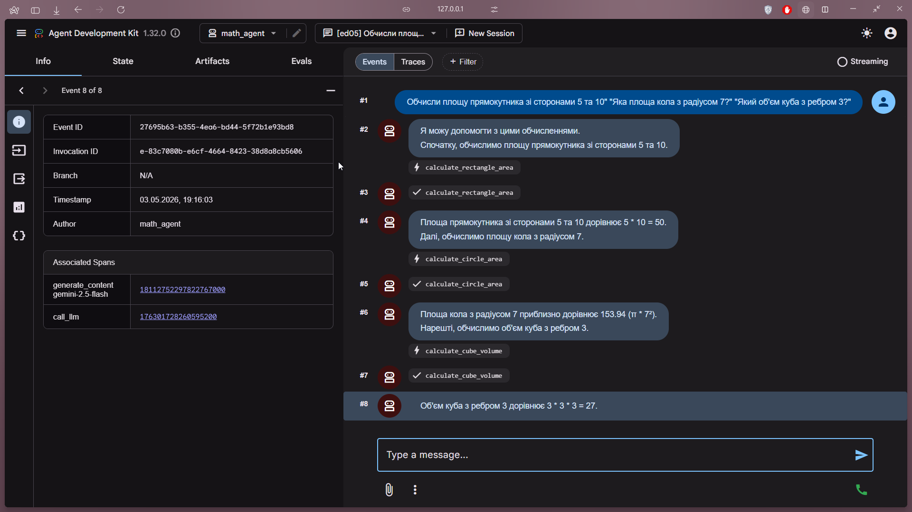
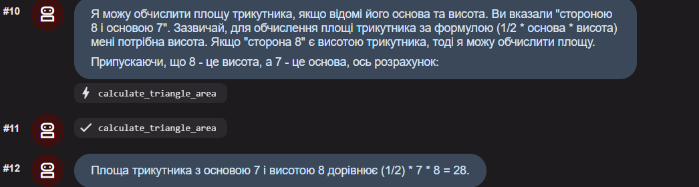

# Звіт до роботи
## Тема: _згідно теми_
### Мета роботи: _згідно теми_

---
### Виконання роботи
* Результати виконання завдання *1...N*;poetry env remove python
    1. Версія поетрі та пайтону: Поетрі 2.3.4, Пайтон 3.13.7    
    1. Переконайтесь що створився файл poetry.lock. Поясніть у звіті для чого потрібен цей файл.
    * цей файл потрібен щоб заблокувати всі версії бібліотек які використовуються в проєкті для стабільної роботи
    3. Версія ADK 1.32ю0
    1. Вкажіть у звіті основні команди ADK:
    * run запускає агента
    * create створює нового агента
    * web забускаєвеб-інтнрфейс
    5.  Збережіть файл та поясніть у звіті що робить кожна частина коду:
    * клас Agent - шаблон, за яким створюються агенти
    * параметр tools - отрібен для того, щоб агент міг користуватися інструментами
    * повертає поточний час у вказаному місті
    6. Зробіть скріншот або скопіюйте діалог з агентом у звіт.
    ```text
     [user]: який зараз час у Києві
     [time_agent]: Зараз у Києві 18:57:42.
    ```
    7. Поставте агенту ще 2-3 запитання про час у різних містах.
   ```text
     [user]: який зараз час у Львові
     [time_agent]: Зараз у Львові 19:03:16.

     [user]: Який зараз час у Запоріжі
     [time_agent]: Зараз у Запоріжжі 19:03:34.
    ```
    8. Протестуйте агента через веб-інтерфейс, поставивши йому кілька запитань.
    *  
    9. Протестуйте агента з наступними запитаннями
    * 
    10. Додайте до агента ще один математичний інструмент на ваш вибір
    * 
    1.  На жаль, сталась непередбачена проблема: в мене повністю вичерпались токени для API, і я просто не зміг продовжити роботу, хоча дуже хотів. Час їх відновлення виявився надто довгим. Мені дуже шкода, і я прошу з розумінням поставитися до цієї ситуації.
### Висновок:
> у висновку потрібно відповісти на запитання:

- в процесі виконання лабораторної роботи дізнався як налаштовувати своїх агентів